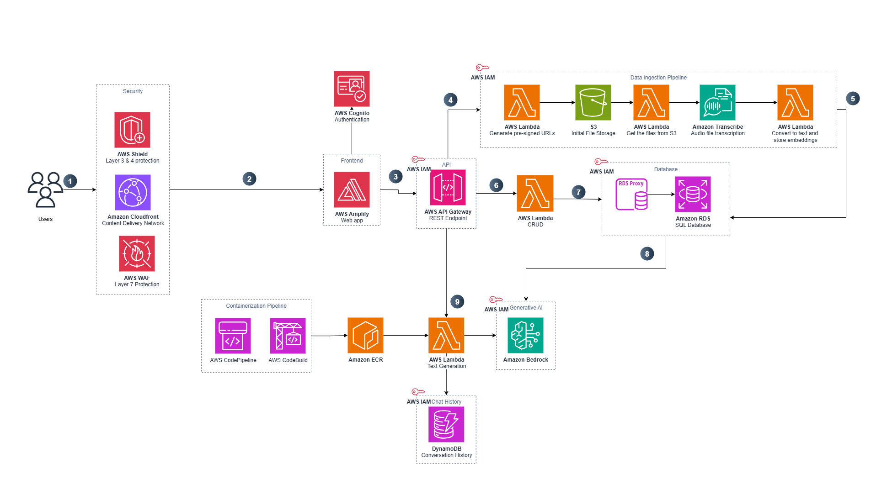

# Research-Data-Insights

This prototype explores how Large Language Models (LLMs) can enhance research workflows by enabling intelligent analysis of large volumes of qualitative and quantitative data. By identifying patterns, scoring responses against user-defined metrics, and surfacing nuanced insights through advanced data processing, it supports more efficient research decision-making, improves accessibility to complex datasets, and fosters deeper understanding of research content through personalized, adaptive AI assistance.

| Index                                               | Description                                             |
| :-------------------------------------------------- | :------------------------------------------------------ |
| [High Level Architecture](#high-level-architecture) | High level overview illustrating component interactions |
| [Deployment](#deployment-guide)                     | How to deploy the project                               |
| [User Guide](#user-guide)                           | The working solution                                    |
| [Directories](#directories)                         | General project directory structure                     |
| [API Documentation](#api-documentation)             | Documentation on the API the project uses               |
| [Credits](#credits)                                 | Meet the team behind the solution                       |
| [License](#license)                                 | License details                                         |

## High-Level Architecture

The following architecture diagram illustrates the various AWS components utilized to deliver the solution. For an in-depth explanation of the frontend and backend stacks, please look at the [Architecture Guide](docs/architectureDeepDive.md).



## Deployment Guide

To deploy this solution, please follow the steps laid out in the [Deployment Guide](./docs/deploymentGuide.md)

## User Guide

Please refer to the [Web App User Guide](./docs/userGuide.md) for instructions on navigating the web app interface.

## Directories

```
├── cdk/
│   ├── bin/
│   ├── lambda/
│   ├── layers/
│   ├── stacks/
│   └── OpenAPI_Swagger_Definition.yaml

├── docs/
│   ├── userGuide.md
│   ├── deploymentGuide.md
│   ├── architectureDeepDive.md
│   ├── securityGuide.md
│   ├── Experimentation_Guide.md
│   ├── data_ingestion.md
│   ├── api-documentation.pdf
│   └── media/

├── frontend/
│   ├── public/
│   └── src/
│       ├── app/
│       └── components/

├── Notebooks/
│   ├── LLM_scoring.ipynb
│   └── RAG_model.ipynb
```

1. `/cdk`: Contains the deployment code for the app's AWS infrastructure
   - `/bin`: Contains the instantiation of CDK stack
   - `/lambda`: Contains the lambda functions for data ingestion, scoring, and other core functionalities
   - `/layers`: Contains the required layers for lambda functions
   - `/stacks`: Contains the deployment code for all infrastructure stacks
   - `OpenAPI_Swagger_Definition.yaml`: API specification for the research data insights service
2. `/docs`: Contains comprehensive documentation for the application including user guides, deployment instructions, and architecture details
3. `/frontend`: Contains the user interface of the research data insights application
4. `/Notebooks`: Contains Jupyter notebooks for experimentation with LLM scoring and RAG (Retrieval-Augmented Generation) models

## API Documentation

Here you can learn about the API the project uses: [API Documentation](./docs/api-documentation.pdf).

## Experimentation Guide

For information on how to experiment with the LLM scoring and RAG models using the provided Jupyter notebooks, see the [Experimentation Guide](./docs/Experimentation_Guide.md).

## Data Ingestion

Details about the data ingestion process and how to work with research datasets can be found in the [Data Ingestion Guide](./docs/data_ingestion.md).

## Security Guide

Security considerations and best practices for deploying and using the research data insights platform are outlined in the [Security Guide](./docs/securityGuide.md).

## Credits

This application was architected and developed by Harsh Amin, Rohit Murali, and <a href="https://www.linkedin.com/in/harleen-chahal-713569141/6" target="_blank">Harleen Chahal</a>. Thanks to the UBC Cloud Innovation Centre Technical and Project Management teams for their guidance and support.

## License

This project is distributed under the [MIT License](LICENSE).

Licenses of libraries and tools used by the system are listed below:

[PostgreSQL license](https://www.postgresql.org/about/licence/)

- For PostgreSQL and pgvector
- "a liberal Open Source license, similar to the BSD or MIT licenses."

[LLaMa 3 Community License Agreement](https://llama.meta.com/llama3/license/)

- For Llama 3 70B Instruct model
