# User Guide

**Please ensure the application is deployed, instructions in the deployment guide here:**
- [Deployment Guide](./deploymentGuide.md)

Once you have deployed the solution, the following user guide will help you navigate the functions available.

| Index    | Description |
| -------- | ------- |
| [Administrator View](#admin-view)  |The administrator can register researchers, and handle the overall AI settings. | 
| [Researcher View](#researcher-view)  | The researcher can start an agenda, add . |
| [Member View](#member-view)  | The student can start a case, interact with AI Assistant, create summaries and transcribe audio interviews. |

All users start by filling their information at the sign up page.  
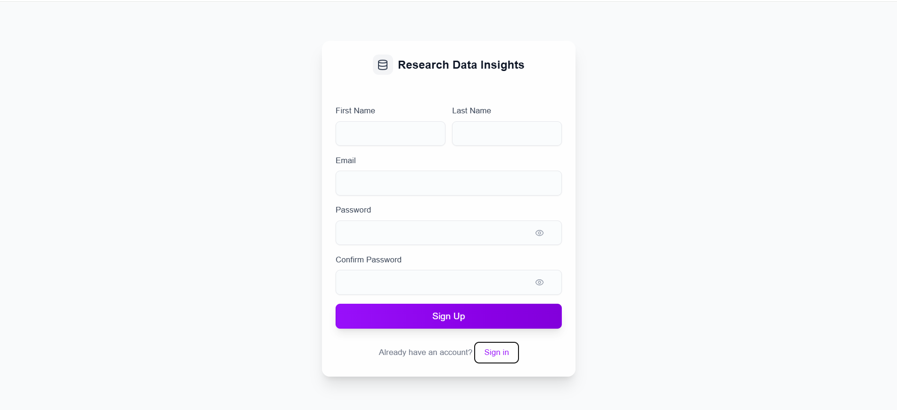

You then get a confirmation email to verify your email and are registered as a user. 

## Administrator View
Once you have an account, to become an adminstrator, you need to change your user group with Cognito through the AWS Console:
<!--  -->

After clicking the user pool of the project, navigate to "Users" on the left navigation bar and find your email:
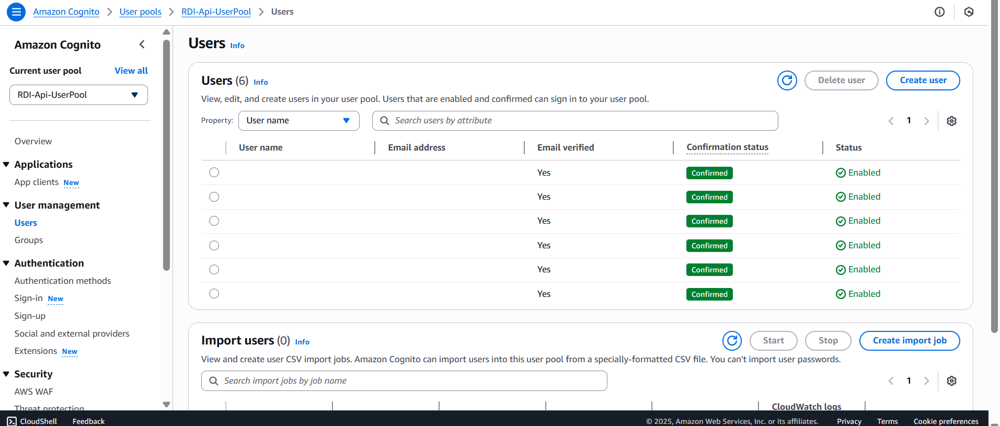

After clicking your email, you can add the 'admin' user group. Start by scrolling down to "Group memberships" and selecting "Add user to group".  
Select the "admin" group from available options. And lastly, confirm that the user has been added to the admin group by checking the "group attributes" of the user:

  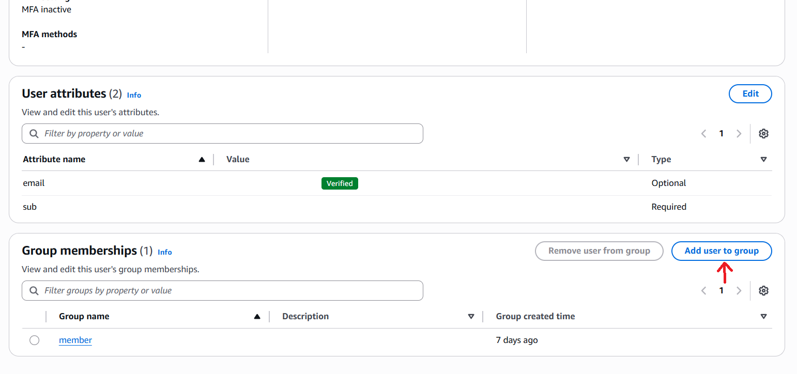
  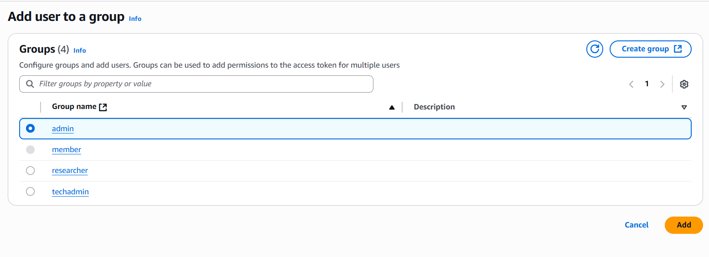

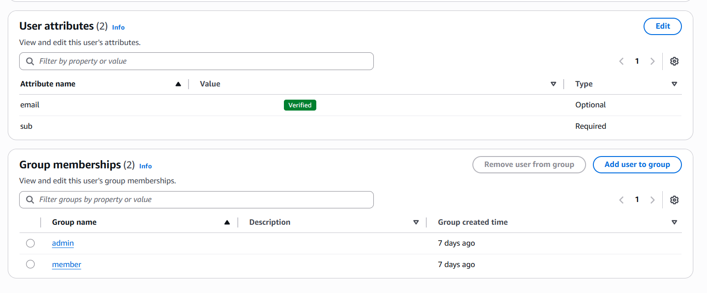

Once the 'admin' user group is added, delete the 'member' user group:

<!-- 

  
  

 -->

Upon logging in as an administrator, they see the following home page:
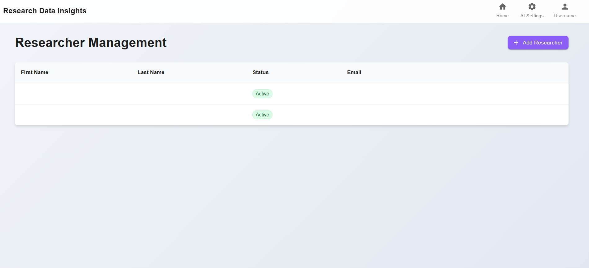

Clicking the "ADD RESERACHER" button opens a pop-up where the administrator can enter the email address of a user with an account to add them as an instructor:
<!--  -->

In the "AI Settings" page, the administrator can set a daily message limit for each user which will alter how many times a user can send messages to the AI Assistant:
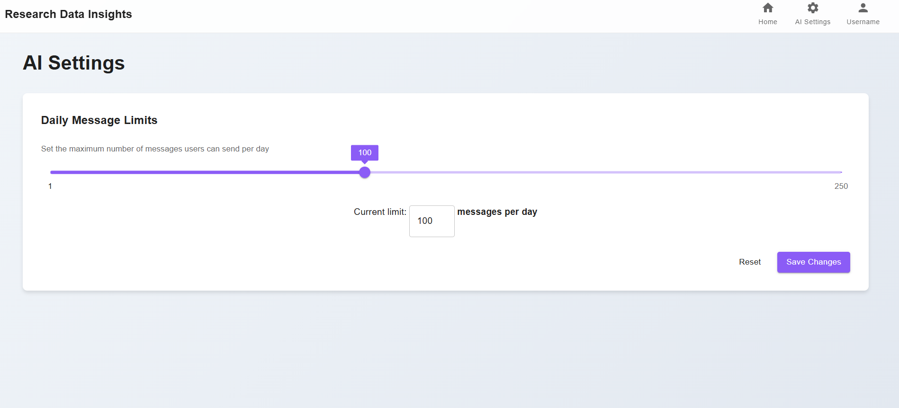

## Researcher View

Upon logging in as an researcher, you’re greeted with a homepage that displays all your recent agendas.

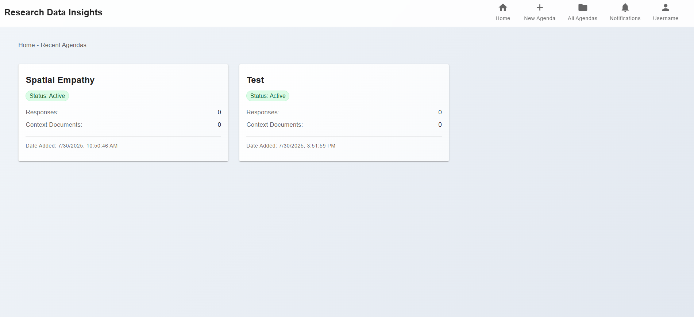

The researcher can start a new agenda by clicking on the "New Agenda" button. 

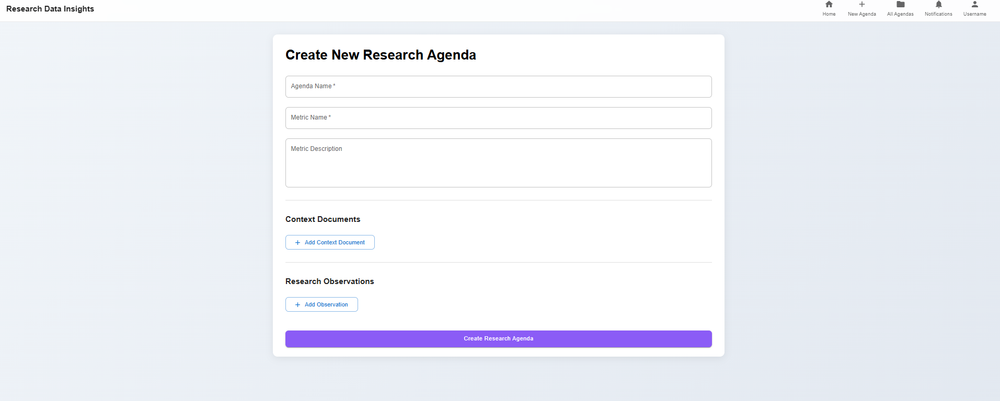

From here, the researcher can input all information related to the agenda including the Title, the metric name and description (Which outlines how the LLM will score responses), the context documents to give the LLM more information about the scoring and response groups for scoring. 

Once submitted, the researcher can interact to get more insights from the LLM. 

On the "Collaborators" tab, the researcher can add members to the research agenda as collaborators.

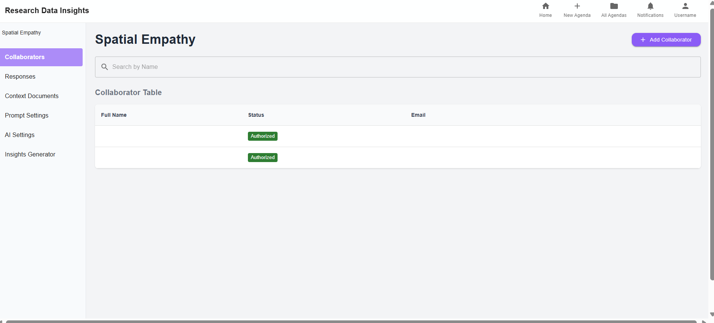

The researcher can add more information and documents using the "Context Documents" and "Response Groups" tabs when 

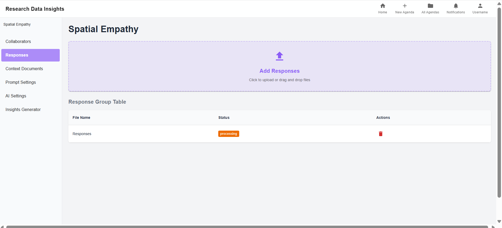
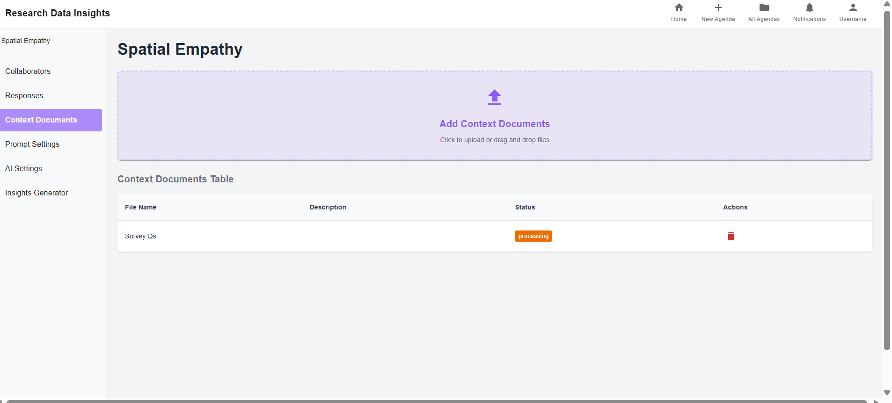